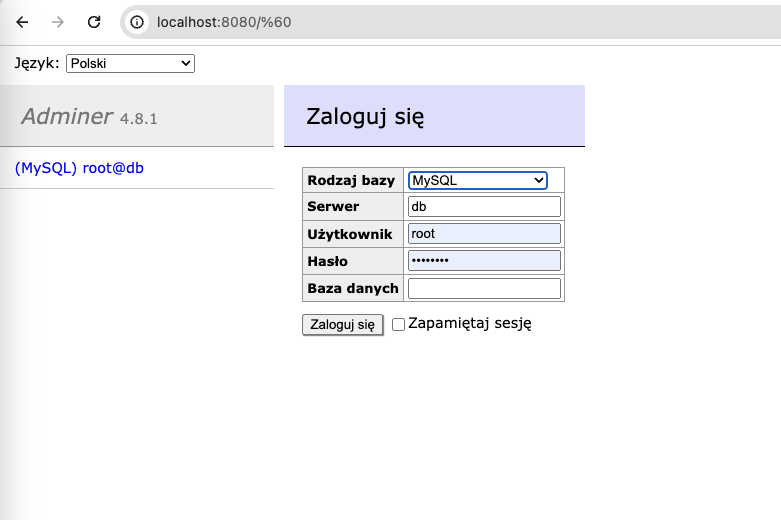

# Warehouse
### Konfiguracja lokalnego środowiska
Wymagania:
- zainstalowany docker desktop
- zainstalowany PHP oraz composer

Jak uruchomić projekt:
1. Po pobraniu repozytorium, będąc w root projektu uruchamiamy bazę danych oraz GUI (Adminer)
za pomocą komendy: `docker-compose -f docker-compose-local-utils.yaml up -d` 
2. Włączamy serwer dla PHP za pomocą: `php artisan serve`

Domyślnie serwer zostaje uruchomiony na localhost port 8000

W celu utworzenia tabel w bazie danych oraz uzupełnienia przykładowymi danymi wykonujemy dwie komendy:
 - `php artisan migrate`
 - `php artisan db:seed --class=DatabaseSeeder`

### Logowanie do Adminera
1. W przeglądarce wpisujemy adres `http://localhost:8080/`
2. Logujemy się za pomocą danych widczonych w załączonym zrzucie ekarnu (hasło = password)

